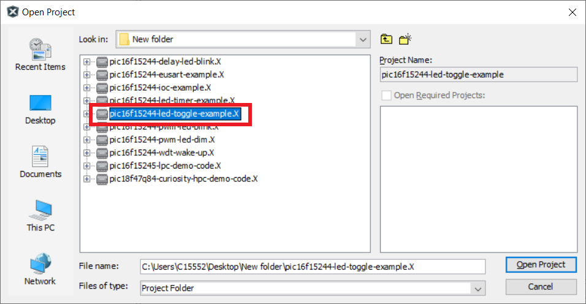
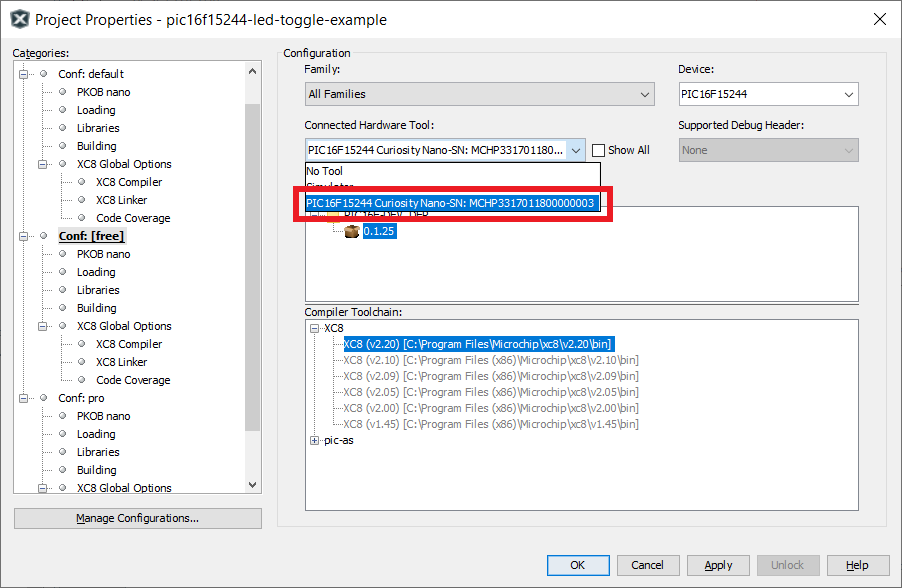
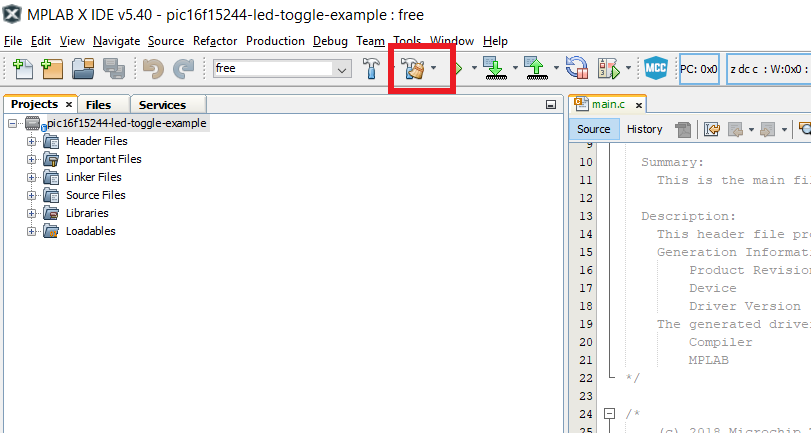
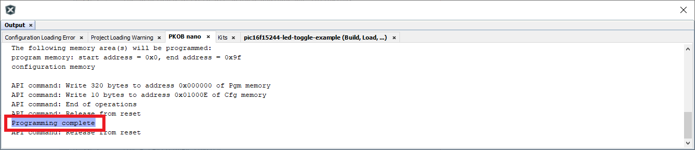
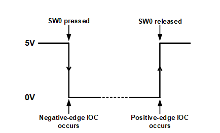

<!-- Please do not change this html logo with link -->

# Toggle an LED using Interrupt-on-Change with PIC16F15244

The 'pic16f15244-led-toggle-example' code example uses the PIC16F15244 Curiosity Nano Development board to demonstrate how to use the Interrupt-on-Change module to toggle an LED. When push-button SW0 is pressed, LED0 is turned off, and when SW0 is released, LED0 illuminates.

##### PIC16F15244 Curiosity Nano Development Board:

## Related Documentation
- [PIC16F15244 Product Page](https://www.microchip.com/wwwproducts/en/PIC16F15244)

## Software Used
- MPLAB® X IDE 5.40 or newer [(microchip.com/mplab/mplab-x-ide)](http://www.microchip.com/mplab/mplab-x-ide)
- MPLAB® XC8 2.20 or a newer compiler [(microchip.com/mplab/compilers)](http://www.microchip.com/mplab/compilers)
- MPLAB® Code Configurator (MCC) 3.95.0 or newer [(microchip.com/mplab/mplab-code-configurator)](https://www.microchip.com/mplab/mplab-code-configurator)
- MPLAB® Code Configurator (MCC) Device Libraries PIC10 / PIC12 / PIC16 / PIC18 MCUs [(microchip.com/mplab/mplab-code-configurator)](https://www.microchip.com/mplab/mplab-code-configurator)
- Microchip PIC16F1xxxx Series Device Support (1.4.119) or newer [(packs.download.microchip.com/)](https://packs.download.microchip.com/)

## Hardware Used
- PIC16F15244 Curiosity Nano [(DMxxxx)]()
- Micro-USB to USB 2.0 cable

## Setup
1. Connect the PIC16f15244 Curiosity Nano board to a PC using the Micro-USB to USB 2.0 cable.
2. If not already on your system, download and install MPLABX IDE version 5.40 (or newer).
3. If not already on your system, download and install the XC8 C-Compiler version 2.20 (or newer).
4. Open the 'pic16f15244-led-toggle-example.X' project as shown in Figure 1.

###### Figure 1: Open Project Window

5. Press the 'Project Properites' button to open the Project Properties window. Select the Curiosity tool from the Tools drop-down menu as shown in Figure 2.

###### Figure 2: Select the Nano in Project Properties Window

6. Press the 'Make and Program Device' button to program the PIC (see Figure 3). Verify that the device was successfully programmed (see Figure 4).

###### Figure 3: 'Make and Program Device' Button

###### Figure 4: Program Complete

## Operation
After the Nano board is programmed, LED0 will be in an 'ON' state. When push-button SW0 is pressed, LED0 will be in the 'OFF' state, and will remain in the 'OFF' state until SW0 is released. Once SW0 is released, LED0 will return to the 'ON' state and remain that way until SW0 is pressed again.

The Interrupt-on-Change (IOC) hardware is configured so that both rising and falling edges of the signal coming from SW0 will generate an interrupt. In normal operation, SW0 is pulled-up to VDD. When SW0 is pressed, the output of SW0 is pulled low, causing IOC hardware to generate a negative-edge interrupt. When the negative-edge interrupt occurs, LED0 is in the 'OFF' state. When SW0 is released, its output signal is pulled back up to VDD, and IOC hardware generates a positive-edge interrupt. When the positive-edge interrupt occurs, LED0 returns to its 'ON' state. Figure 5 shows the activity that occurs when SW0 is pressed and released.

###### Figure 5: SW0 Activity

## Summary
The 'pic16f15244-led-toggle-example' code example highlights the use of the Interrupt-on-Change (IOC) module to toggle an LED. When IOC hardware detects a negative-edge signal transition, LED0 is OFF. When IOC hardware detects a positive-edge signal, LED0 is ON.
